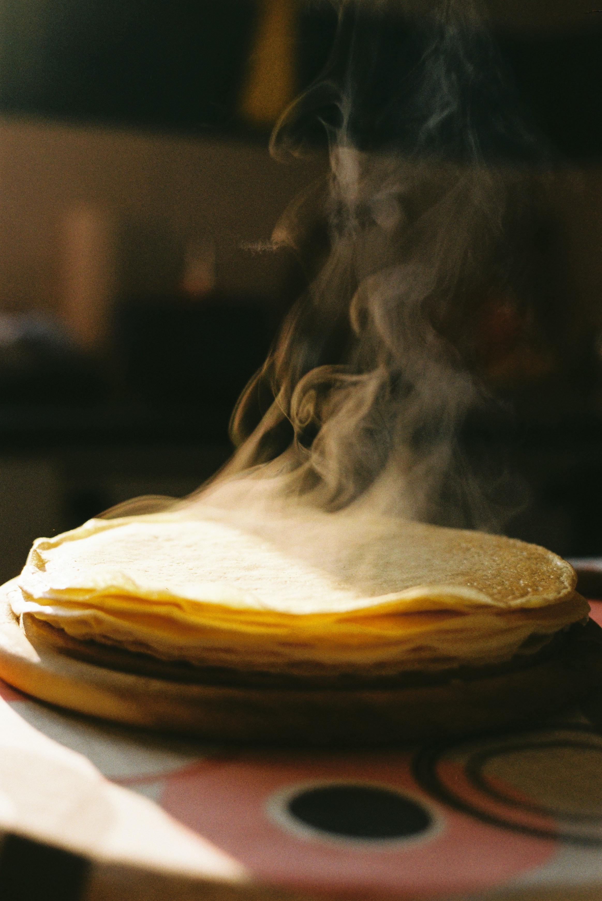

# Pâte à crèpes

## Ingrédients

+ 300g de farine
+ 3 œufs entiers
+ 3 cuillères à soupe de sucre
+ 2 cuillères à soupe d'huile
+ 50g de beurre fondu
+ 60 cl de lait
+ 5 cl de rhum

## Marche à suivre

1. Mettre la farine dans une terrine et former un puits.
2. Y déposer les oeufs entiers, le sucre, l'huile et le beurre.
3. Mélanger délicatement avec un fouet en ajoutant au fur et à mesure le lait. La pâte ainsi obtenue doit avoir une consistance d'un liquide légèrement épais.
4. Parfumer de rhum.
5. Faire chauffer une poêle antiadhésive et la huiler très légèrement. Y verser une louche de pâte, la répartir dans la poêle puis attendre qu'elle soit cuite d'un côté avant de la retourner. Cuire ainsi toutes les crêpes à feu doux.

Photo by <a href="https://unsplash.com/@iisus_d_costea?utm_source=unsplash&amp;utm_medium=referral&amp;utm_content=creditCopyText">Octavian Catană</a> on <a href="https://unsplash.com/collections/85039754/teaching-code?utm_source=unsplash&amp;utm_medium=referral&amp;utm_content=creditCopyText">Unsplash</a>
